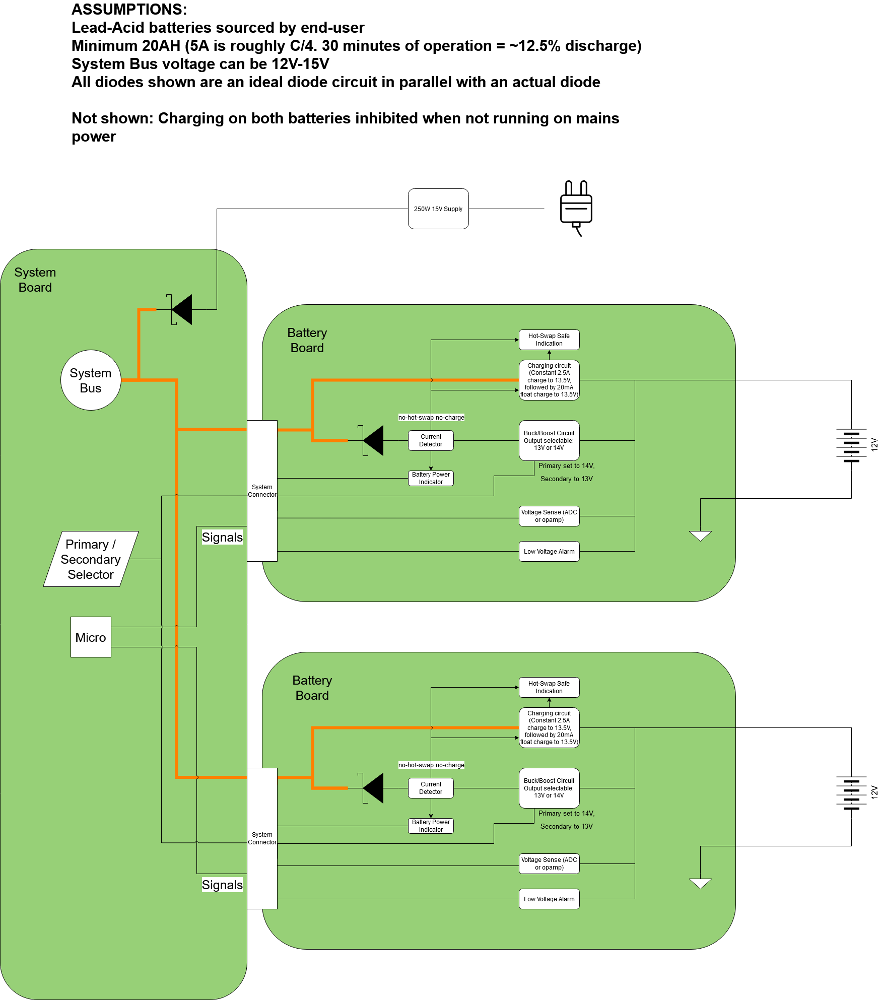

# Power Supply Controller Design

## Block Diagram

## Requirements

1. 110/220V
2. 50hz/60hz
3. 150W Mains
4. 20 Minute backup battery
5. Hot swappable battery (run on one battery while changing the other)
6. Trickle charge while on mains
7. Uninterpretable & without transients
8. Audible alarm indicate when power is from battery
9. Audible alarm indicate when battery is running low
10. System voltage must remain >12v at all battery states of charge.
11. Minimum single points of failure.
12. Built-in-tests to confirm operation of each power supply
13. One battery shall be primary, the other secondary.
14. The primary battery shall discharge before the secondary.
15. The battery system shall work with any 12v lead-acid battery

## 
